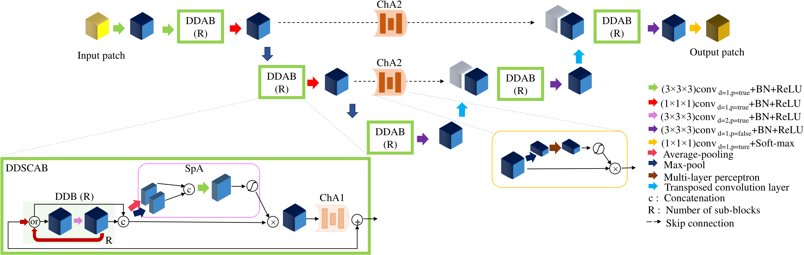
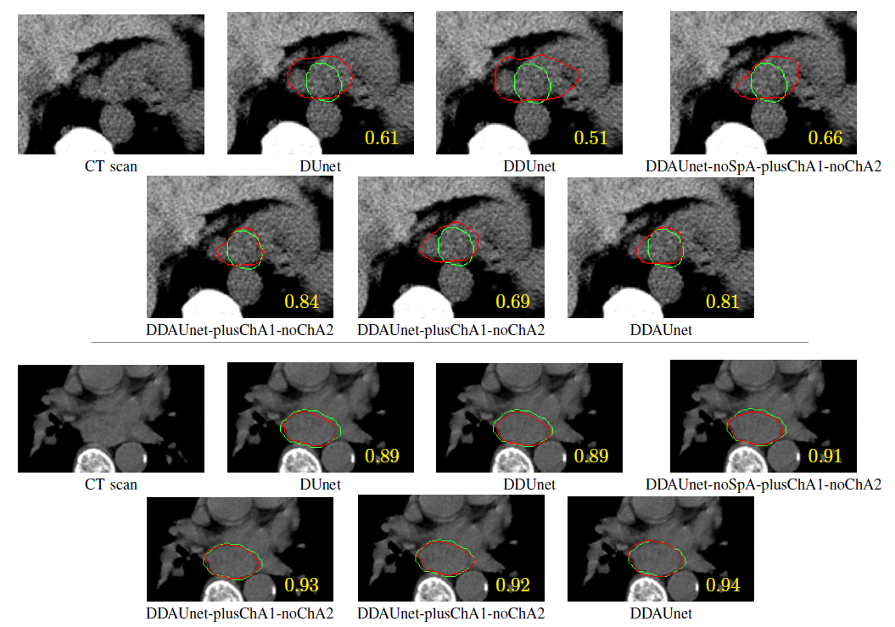

# Dilated Dense Attention Unet (DDAUnet) for Esophageal GTV Segmentation


Find the manuscript here: https://ieeexplore.ieee.org/document/9481104
# Proposed CNN
<p>
    
    <em>Figure 1- DDAUnet network.</em>
</p>

# Results
<p>
    
    <em>Figure 2- Qualitative comparison of DDAUnet with the other CNNs for two slices from two distinct patients. 2D DSC
values are show in yellow. The manual delineation and the network results are shown by green and red contours, respectively.</em>
</p>

# Citation
    @article{yousefi2021esophageal,
      title={Esophageal Tumor Segmentation in CT Images using a Dilated Dense Attention Unet (DDAUnet)},
      author={Yousefi, Sahar and Sokooti, Hessam and Elmahdy, Mohamed S and Lips, Irene M and Shalmani, Mohammad T Manzuri and Zinkstok, Roel T and Dankers, Frank JWM and Staring, Marius},
      journal={IEEE Access},
      year={2021},
      publisher={IEEE}
    }


    @inproceedings{yousefi2018esophageal,
      title={Esophageal gross tumor volume segmentation using a 3D convolutional neural network},
      author={Yousefi, Sahar and Sokooti, Hessam and Elmahdy, Mohamed S and Peters, Femke P and Shalmani, Mohammad T Manzuri and Zinkstok, Roel T and Staring, Marius},  
      booktitle={International Conference on Medical Image Computing and Computer-Assisted Intervention},
      pages={343--351},  
      year={2018},  
      organization={Springer}
    }
       
   
# Requirments
```
pip install -r ./requirements.txt
```
